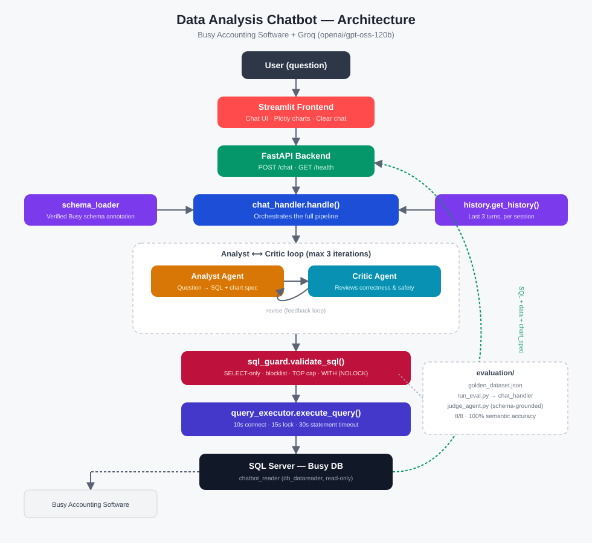

# Data Analysis Chatbot — Busy Accounting Software

A natural-language chatbot for querying business data (Sales, Purchase, Stock,
Account, Outstanding) stored in **Busy Accounting Software's** SQL Server
database — built with **Groq** (`openai/gpt-oss-120b`) and an **Analyst/Critic**
agent loop, exposed via **FastAPI** and a **Streamlit** chat UI.

Ask questions like *"Show me top 5 items by sales amount"* or *"What are the
total sales for the group Series EM Wake Up"* and get real SQL, real data, and
an auto-generated chart — without opening Busy or writing SQL by hand.

---

## Why this exists

Busy's built-in reports work well, but require navigating menus and don't
answer cross-cutting or conversational questions. This chatbot sits on top of
the same live database as a **read-only, natural-language query layer** — it
does not replace Busy for data entry, compliance reports (GST/Trial
Balance/P&L), or anything requiring guaranteed statutory accuracy.

---

## Tech Stack

| Layer | Technology | Purpose |
|---|---|---|
| LLM | **Groq API** — `openai/gpt-oss-120b` | Question → SQL generation, review, and semantic judging |
| Backend | **FastAPI** + **Uvicorn** | REST API (`/chat`, `/health`) |
| Frontend | **Streamlit** + **Plotly** | Chat UI with inline bar/line/pie chart rendering |
| Database | **SQL Server** (Busy Accounting Software) | Source of truth — accessed read-only |
| DB Driver | **pyodbc** + **SQLAlchemy** | Connection pooling, timeouts, query execution |
| Config | **pydantic-settings** + **python-dotenv** | `.env`-based configuration |
| Testing | **pytest** | Unit tests for the SQL safety layer |
| Environment | **Conda** (Python 3.11) | Isolated dependency management |

**Design pattern:** Analyst/Critic multi-agent loop — one LLM call proposes
SQL, a second LLM call independently reviews it for correctness and safety
before anything touches the database. Both are grounded in the same
hand-verified schema annotation, not raw `INFORMATION_SCHEMA` output.

---

## Architecture




---

## Setup

### 1. Clone and create the environment

```bash
git clone <your-repo-url>
cd Data-Analysis-chatbot
conda create -n DA-chatbot python=3.11
conda activate DA-chatbot
pip install -r requirements.txt
```

### 2. Configure environment variables

```bash
cp .env.example .env
```

Edit `.env` with your actual values:

```dotenv
DB_SERVER=localhost\SQLEXPRESS2025
DB_NAME=BusyComp0001_db12025
DB_USER=chatbot_reader
DB_PASS=your_password_here
DB_DRIVER=ODBC Driver 17 for SQL Server

GROQ_API_KEY=your_groq_api_key_here
GROQ_MODEL=openai/gpt-oss-120b

MAX_CRITIC_ITERATIONS=3
```

**Important:** the SQL Server login used here should be a **dedicated
read-only login** (`db_datareader` role only), not your main Busy admin
credentials — see [Database setup](#database-setup) below.

### 3. Run the backend

```bash
python run.py
```

Runs on `http://localhost:8000`. Health check: `GET /health`.

### 4. Run the frontend (in a separate terminal)

```bash
conda activate DA-chatbot
streamlit run frontend/streamlit_app.py
```

Opens at `http://localhost:8501`.

---

## Database setup

The chatbot connects with a **dedicated, read-only SQL login** — never your
main Busy credentials.

```sql
CREATE LOGIN chatbot_reader WITH PASSWORD = 'YourStr0ng!Pass123', CHECK_POLICY = OFF;

USE BusyComp0001_db12025;
CREATE USER chatbot_reader FOR LOGIN chatbot_reader;
ALTER ROLE db_datareader ADD MEMBER chatbot_reader;
```

This is enforced at two levels:
1. **Database permissions** — `chatbot_reader` can only read, never write.
2. **`sql_guard.py`** — rejects anything that isn't `SELECT`/`WITH`, blocks
   `DROP`/`DELETE`/`UPDATE`/`INSERT`/etc., and adds `WITH (NOLOCK)` hints so
   read queries never block Busy's live transactions.

---

## What this chatbot can answer (v1 scope)

All of the following were **manually verified** against Busy's own UI (not
guessed from column names — Busy's schema uses generic, cryptic columns like
`Value1/2/3`, `MasterCode1/2` that require reverse-engineering):

| Report type | Supported | Notes |
|---|---|---|
| Item-wise Sales / Purchase | ✅ | `Tran2` joined to `Master1` (MasterType=6) |
| Group-wise Sales (any hierarchy depth) | ✅ | Recursive CTE — group depth is not fixed |
| Account Books / Summary | ✅ | `Master1` (MasterType=2) |
| Outstanding Analysis | ⚠️ Partial | **Net movement over a date range only** — absolute/opening balance is not stored anywhere findable in the DB |
| Stock / Inventory | ⚠️ Partial | **Net stock movement over a date range only** — same limitation as above |
| Salesman-wise Sales | ❌ | Salesman field exists but is not populated on any voucher in this Busy install |
| Trial Balance / P&L / Balance Sheet | ❌ | Not yet reverse-engineered |
| GST / TDS / Payroll Reports | ❌ | Not yet reverse-engineered |

The chatbot is designed to **explicitly decline** unsupported questions with a
clear reason, rather than guess or hallucinate an answer. This is enforced by
the schema annotation's "EXPLICIT LIMITATIONS" section and checked by both the
Analyst and Critic agents.

---

## Evaluation

A golden dataset of verified test questions lives in `evaluation/golden_dataset.json`,
covering both answerable and correctly-declined questions.

```bash
python -m evaluation.run_eval
```

This runs the **entire live pipeline** (Analyst → Critic → Guard → real
database) against each test case and an LLM-judge (grounded in the same
schema annotation, to avoid generic/incorrect assumptions) checks semantic
correctness. A timestamped report is saved to `evaluation/reports/`.

**Current baseline: 8/8 test cases, 100% semantic accuracy, 100% decline
accuracy.**

### A note on Groq's rate limits

The free/on-demand tier has both a **per-minute** (TPM) and a **per-day**
(TPD, 200,000 tokens) limit. A full evaluation run plus interactive testing
can approach the daily limit on a heavy testing day — if you hit a `429`
error mentioning `tokens per day`, this is expected and resets every 24
hours (UTC). `run_eval.py` includes a delay between test cases to avoid the
per-minute limit, and catches exceptions so one rate-limited case doesn't
crash the whole run.

---

## Unit tests

```bash
pytest tests/ -v
```

`tests/test_sql_guard.py` covers the deterministic safety logic (no LLM
calls, runs in milliseconds) — including **regression tests for a real bug**
hit during development, where the `WITH (NOLOCK)` insertion regex incorrectly
consumed `WHERE`/`GROUP BY` keywords as if they were table aliases, silently
corrupting generated SQL.

---

## Safety design (why this won't lock or slow down Busy)

This was a real incident during development — see the reasoning baked into
the code as a result:

1. **`WITH (NOLOCK)`** added to every generated query — reads never wait for
   or hold locks that could block Busy's live writes.
2. **Connect timeout (10s)** — a hung connection attempt fails fast instead
   of hanging.
3. **`SET LOCK_TIMEOUT`** (15s) — if a query genuinely needs a lock and can't
   get one, it fails cleanly instead of blocking indefinitely.
4. **pyodbc statement timeout (30s)** — a hard ceiling on total query
   execution time, regardless of cause.
5. **Connection pool recycling** (5 min) — reduces the chance of stale/leaked
   connections accumulating over a long-running session.
6. **`chat_handler.py`** catches all query execution errors (including
   timeouts) and returns a clean, user-facing message instead of crashing or
   hanging the request.

**Practical rule going forward:** never force-kill a terminal running a live
database query. Let it finish, or use `Ctrl+C` and wait for a graceful exit.

---

## Known limitations

- **Opening balances** (party Outstanding, item Stock) cannot be found
  anywhere in the database — only *net movement over a date range* is
  supported. Extensively searched — considered a dead end unless Busy's
  support team provides documentation.
- **Salesman-wise reporting** is not supported — the field is not populated
  on vouchers in this Busy installation. Revisit if/when data entry practice
  changes.
- **`VchType`** (numeric voucher type code) is not fully decoded — the system
  does not currently distinguish Sale vs. Purchase vs. Receipt vs. Payment by
  this column directly (relies on `MasterType` context instead).
- Conversation history is passed to the Analyst for the **last 3 turns only**
  (per session, in-memory — resets on server restart). Not persisted to disk.

---

## Extending this project

To add a new report type (e.g., Trial Balance):
1. Reverse-engineer the relevant tables/columns against Busy's UI, using a
   known reference transaction (see the method documented in
   `busy_schema_annotation.py`'s history/comments).
2. Add the verified mapping and a query template to
   `BUSY_SCHEMA_ANNOTATION` in `app/database/busy_schema_annotation.py`.
3. Add corresponding test cases to `evaluation/golden_dataset.json`.
4. Run `python -m evaluation.run_eval` to confirm correctness before
   considering it supported.
5. Remove it from the "EXPLICIT LIMITATIONS" section once verified.

**Do not** skip step 4 — an unverified mapping presented as a supported
feature risks the chatbot confidently returning wrong numbers.